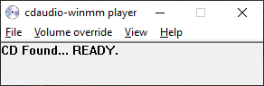

## What is it?

This is a winmm wrapper to a separate cdaudio player that handles the track repeat that is broken from Windows Vista onwards (among fixing other things MS broke in mcicda implementation). Unlike the ogg-winmm wrapper which plays ripped .ogg files cdaudio-winmm instead tries to directly play the cdtracks on a physical disc (or cdimage) using a separate player program. Communication between winmm.dll and the player is done using [mailslots.](https://learn.microsoft.com/en-us/windows/win32/ipc/mailslots) 

The trick is to handle the broken MCI mode change by monitoring POSTION and MODE. If MODE = "playing" and POSITION has not changed then we can determine that the track has finished playing and can update the MODE and send the MM_NOTIFY_SUCCESSFUL message (if requested). The cdaudio player code might also be useful to anyone wanting to write an MCI cdaudio player on newer Windows systems.

# Usage:

- Place winmm.dll wrapper into the game folder.
- Place cdaudioplr.exe in 'mcicda' -sub-folder.
- Run the game normally.

NOTE:
- You can start cdaudioplr.exe manually before running the game. Sometimes this may be necessary since the game may query the cd device before the wrapper has time to initialize the player. There is now also a batch file that can be used to make sure that the cdaudioplr.exe is launched before the game:  
https://raw.githubusercontent.com/YELLO-belly/cdaudio-winmm/master/batch/start_game.cmd  
(right click on link and choose save link as...)  
A [vbscript](https://raw.githubusercontent.com/YELLO-belly/cdaudio-winmm/master/vbscript/start_game.vbs) is also available...
- Do not place cdaudioplr.exe and winmm.dll in the same folder!
- ~~v.0.3 now supports mp3 and wav playback if a music folder is found containing the tracks in the correct format. (track02.mp3/wav ...)~~ No longer available in 1.5.  

Extra note:
- Apparently on some machines the local winmm.dll wrapper is ignored and the real system dll is used instead. This may be because some other program has already loaded the winmm.dll library or some system setting forces the use of the real dll. The wrapper can be forced to load by renaming it to for example to winm2.dll and hex editing the program executable to point to this renamed winmm.dll instead.
- There is now also a PowerShell script available in the sources to help alleviate issues where the wrapper is ignored by Windows.  
See: https://github.com/YELLO-belly/ogg-winmm/tree/master/PS-Script  
or: https://github.com/YELLO-belly/ogg-winmm/raw/master/PS-Script/force-winmm-loading.ps1  
(right click on link and choose save link as...)

## cdaudio-winmm player v.1.6.3(fix) re-upload:
- **v.1.6.3(fix)** Fixes a small error that caused the "StartMin" cdaudioplr.exe option to not always work.
- **v.1.6.3(fix)** Trim down the long wait loops from 3 seconds to 300 ms in winmm.dll wrapper.
- **v.1.6.3(fix)** Redone AutoStart code to use system "start" command instead of ShellExecute.
- cdaudioplr now has an .ini file option to start minimized in the task bar
- winmm.ini option to force all tracks to be seen as audio. (Useful if a game needs a pure audio CD with no data tracks)
- Integrated various small fixes from ogg-winmm.
- Fixed some logic errors mainly for mciSendString method.

## cdaudio-winmm player v.1.6.2:
- MCI_PLAY now returns mode=playing without any delay. Previous logic had a waiting counter to make sure that the cdaudio device was actually playing. However although the old logic seemed to work fine it was causing serious unreliability with the game Battlezone2 (at least when using a physical CD in a real DVD/CD-ROM drive).

- winmm.ini StartDelay = 0 is now actually zero instead of 1500 ms. This is mainly useful if you are starting the cdaudioplr.exe manually or if a batch file is used to automate the starting process. In this case no startup delay should be necessary and possibly some programs might not like the forced startup delay from winmm.dll wrapper.

## cdaudio-winmm player v.1.6.1:
- 1.6.1 introduces a major performance fix. cdaudioplr.exe no longer relies on MCI_PAUSE but instead uses the same code that handles the last track bug to store the play position using MCI_STOP and MCI_SEEK. Pause command for cdaudio in the MCI API seems to be somewhat broken as it was causing a very noticeable lag / unresponsiveness of the device. Better to avoid using it.

- cdaudiopler.exe uses a named timer to keep the player program responsive in case a game hogs all the resources. The previous trick of using the last cpu core is still available under cdaudio_vol.ini LastCore = 1 option.

- There is yet another interesting bug in the Microsoft mcicda driver. That is if the last track of the CD is played to the very end then all subsequent playback commands will cause the music to be very choppy with constant annoying pauses. This is not an issue if the program calls mci_close and mci_open to re-initialize the device after end of media is reached. However as this was not an issue on Windows versions prior to Vista many programs will simply call a new mci_play and trigger the bug. The workaround for this issue in v.1.6 is to re-initialize the mcicda device whenever a play command finishes.

## cdaudio-winmm player v.1.5.2:
- Fix mciSendCommand DeviceType case sensitive. To keep in line with the ogg-winmm fork changes. Some games can use DeviceType "CDAudio" in which case the old logic was failing since it looked only for the lower case "cdaudio" string.

## cdaudio-winmm player v.1.5.1:
- Added a manual startup delay adjustment in winmm.ini. This can be changed from 1-9 seconds (whole numbers only). The default is 0 which will set a 1.5 second delay as will invalid values. The startup delay determines how long the cdaudioplr.exe has time to initialize itself.

## cdaudio-winmm player v.1.5 final rev:
- A very small but important revision to the wait time for mode change. Turns out 1 second is not enough in some cases. It is now increased to 3 seconds maximum wait time for the mode change. In theory though depending on the quality of the CD-ROM disc and the CD/DVD drive it could take more than 3 seconds. Another option could have been to set an infinite wait but if something goes wrong this could result in the game deadlocking.
- MCIDevID option now uses the real MCI to open waveaudio device and to lock that id for the emulation. Solves issues with games that are not happy with the fake 48879 id.
- SendMessageA for for the notify message is now in its own thread. It was causing a latency/ lock up when send from inside the mailslot reader thread.
- Longer initial sleep in the wrapper to wait for cdaudioplr.exe to initialize.  

## cdaudio-winmm player (Experimental v.1.5):

- Attempt to bring in improvements from ogg-winmm. Should now support MSF and Milliseconds time formats as well as other previously missing functions.
- Removed the previous capability of using .wav or .mp3 files. This is now purely for playback directly from the disc.
- The nature of the server to client system using Mailslots causes issues that have been difficult to resolve. Hence this release should be considered experimental.

## cdaudio-winmm player (beta v.0.4.0.3) -UPDATED-:  
(Marked as v.1.0 in the releases.)  

- MCI device ID now defaults to 0x1 (int 1). Old 0xBEEF (int 48879) can be restored from winmm.ini. (edited cdaudio-winmm.c, winmm.ini)
- Non cdaudio related MCI commands are now relayed to the real winmm for video playback, etc. (taken from AyuanX ogg-winmm fork) (edited cdaudio-winmm.c, cdaudio-winmm.def, stubs.c)
- Subsequently MCI_GETDEVCAPS needs to be handled now. (edited cdaudio-winmm.c)
- Needed to Add some extra complexity in the player loop where the fact that the mailslot can send a new notify msg request before the player loop is finished caused music not to repeat. (edited cdaudioplr_src\cdaudioplr.c -> new skip_notify_msg variable)

# Original changelog:

0.4.0.3 changes:
- Better no. of tracks logic. Should now work more reliably.
- Set player to always run on the last CPU core to fix issues with games set to run on single core affinity (e.g. Midtown Madness).
- Handle TMS time format (Driver).

Note: This may be the last maintenance release. Implementing support for games that switch between different time formats and use milliseconds to play a tracks from arbitrary position will require a full re-write of the logic. In addition a better wrapper is needed to only catch commands send to the cdaudio device and not swallow other commands that are meant for video playback for example. The latency with Mailslot communication is also proving difficult to manage as the logic becomes more complex.

0.4.0.2 changes:
- Using the waveaudio device for .wav file playback.
- Fix MCI_STATUS_POSITION for current track in TMSF (MidtownMadness Open1560 compatibility)

0.4.0.1 changes:
- Fixed a dgVoodoo2 ddraw.dll wrapper incompatibility issue with track repeats.

0.4 changes:
- Added "AutoClose" option in winmm.ini.
- MciSendCommand improvements from ogg-winmm project. Support for more games.
- MciSendString improvements copied from ogg-winmm.
- AuxVolume control enabled. (should use in-game volume sliders. Manual volume override available for problematic cases)
- SetCurrentDirectory fix for cdaudioplr.exe when started from winmm.dll.

0.3 changes:
- mp3/wav support
- cleared up some naming inconsistency

# Building:

Build with make.cmd if path variables are set (C:\MinGW\bin).
Or build from msys with command: mingw32-make

